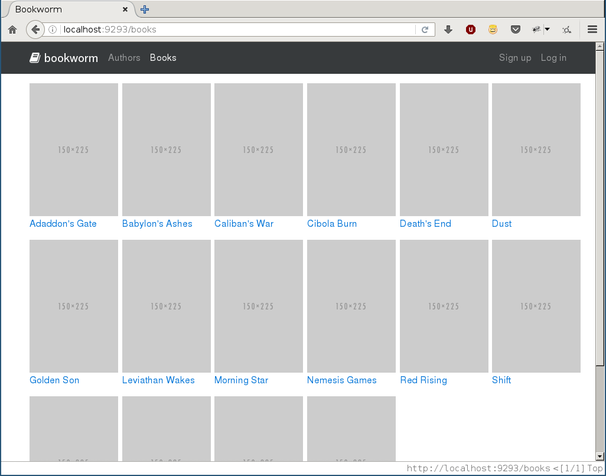
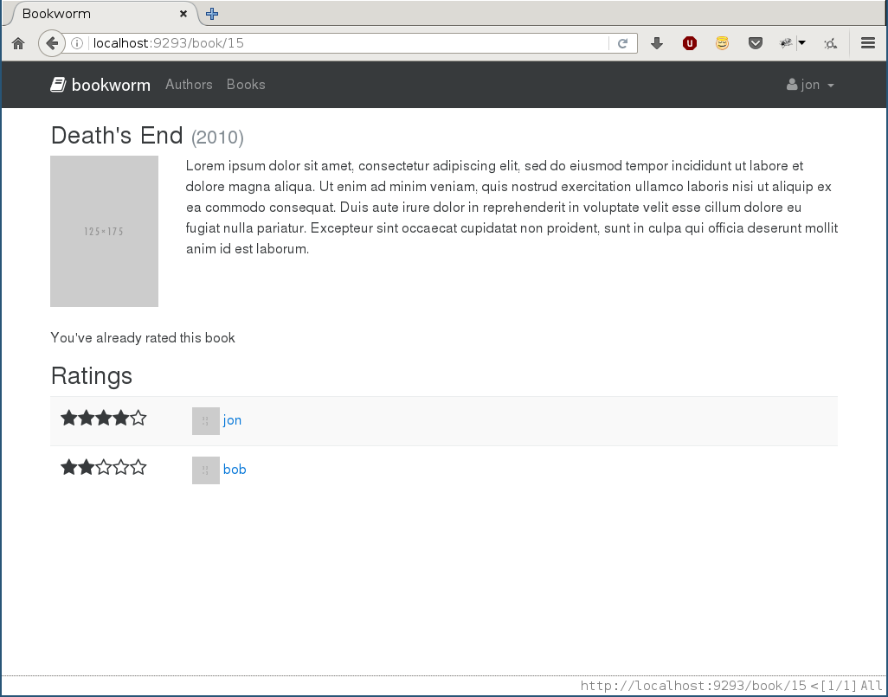

`bookworm-client` is [Sinatra]() web application that implements the
[`bookworm-api`](http://github.com/jonblack/bookworm-client) HAL API.

# Requirements

* ruby
* bundler

# Run

Install the dependencies with:

    bundle install

And run the application:

    rerun -- rackup -s Puma -p 9293

Open http://localhost:9293 in your browser.

# Rubocop

Static analysis can be run with rubocop:

    rubocop

It uses the same settings as in
[blendle/blendle-styleguides](https://github.com/blendle/blendle-styleguides).

# Wishlist

* Tests
* Asynchronous javascript calls to the back (e.g. for rating a book)

# Notes

haml seems to be the most popular frontend templating language for Sinatra but
it's syntax was too much to learn along with learning Ruby, HAL, and Sinatra,
so I decided to use erb which is very similary to jinja2.
